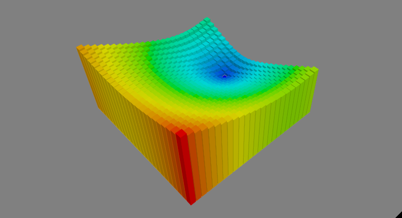
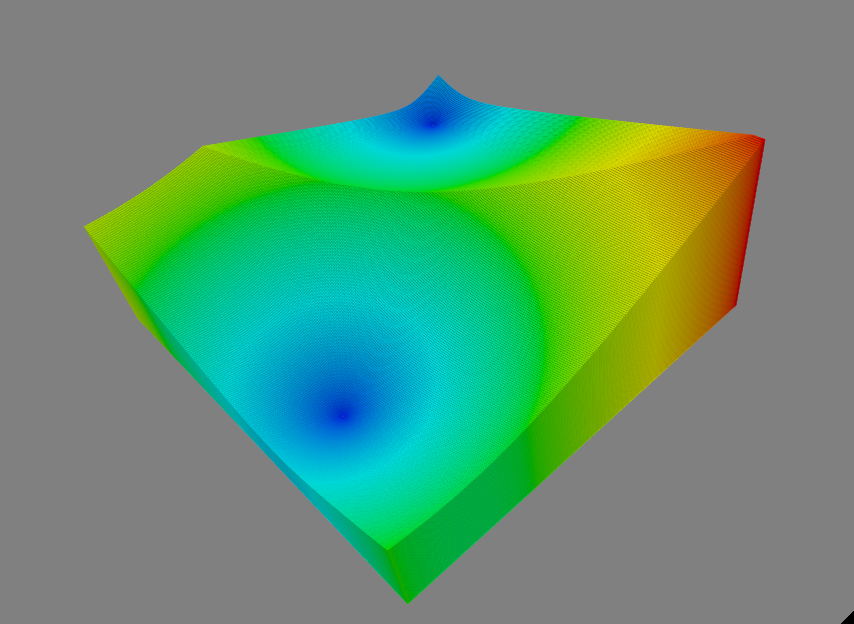
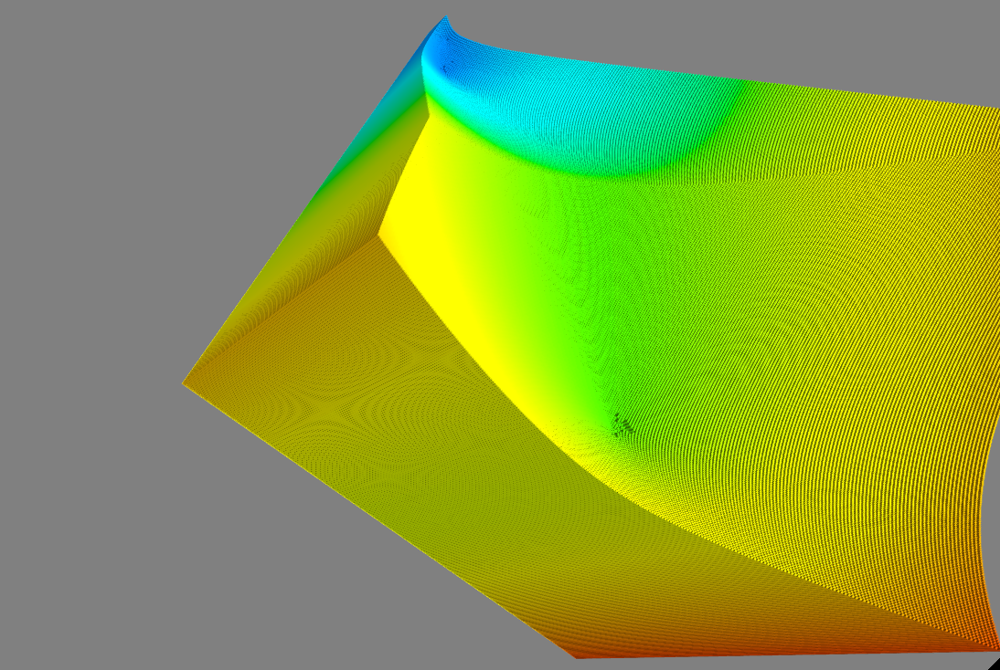
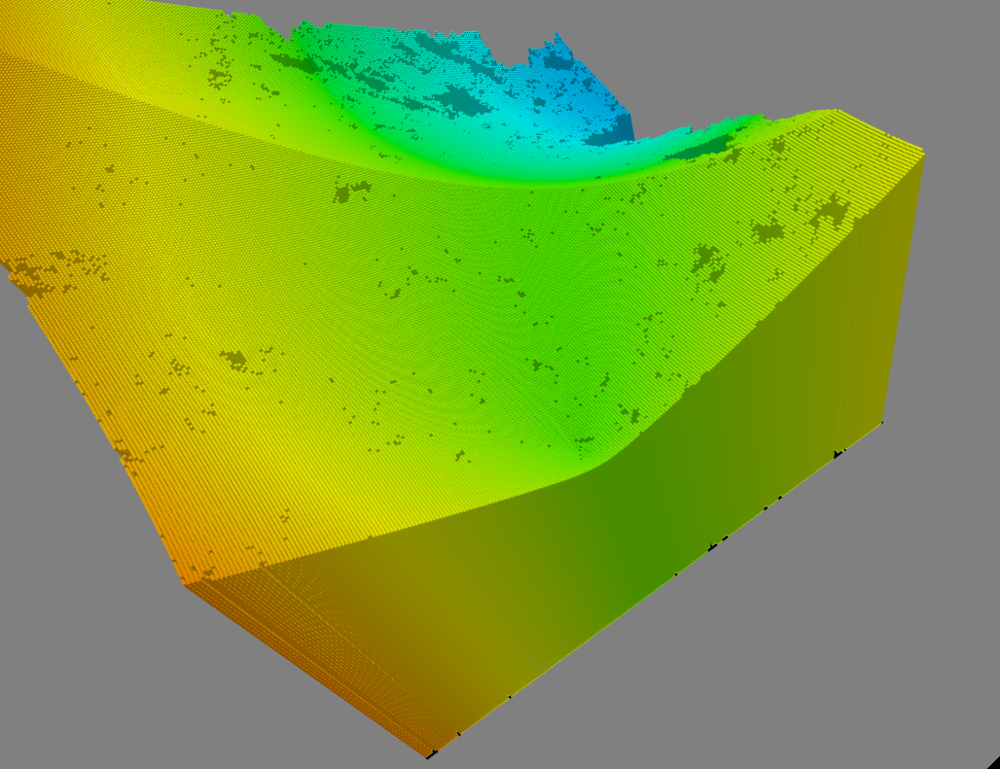

ALife
=====

modelling artificial creature behavior and emotions with CLA

# Dependencies
 - python2
 - NuPIC
 - [utility encoder branch to NuPIC](https://github.com/breznak/nupic/tree/utility-encoder)
 - (mayavi - via pip)

# Goals: 
 - action learning - learning prerequisities, effects and "meaning" of action. Imagine a baby learning to "see" or control its legs. 
 - emotions - emotions to represent inner state, goals, uncontious reactions (fear, hunger); using `utility-encoder`
 - behavior - How it can simplify programming when sub-goals shift priorities automatically according to inner/outer/random conditions. 

# Experiments / Run:
 - simple utility map of a terrain, eucl. distance to target:
   `python alife/experiments/utility_map/utility_map.py`
   

     
     
Utility as a distance to target.

   

 - behavior: goal is to reach target, but with each step, the agent becomes more and more hungry, it also perceives food located on a map
   and plans accordingly. 
   `python alife/experiments/behavior/utility_map.py`

   

     
     
Locations of food - attractors, influence changes with hunger level.

   

   
 and target and hunger combined... 

   

     
     
Overall utility of target & food (*.

   

  `python alife/experiments/behavior/random_walk_map.py`
   

     
     
A single random walk with utility, food, target,...

   

